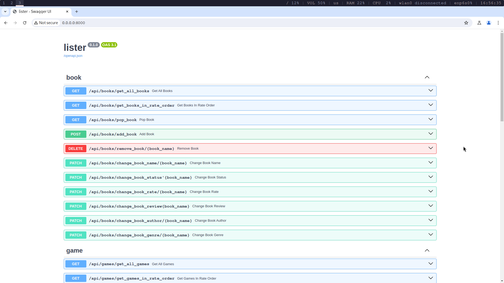

# lister
project designed to structure lists of games i want to play, books i want to read, etc. And find new projects i intrested in.

-- it's time to rewrite everithing from scratch

## buld project
1. set up secrets for db, bot, etc.:
    create your .env file with environment variables from .env.example file
2. up all services:
    just 'docker compose up' api will be in 0.0.0.0:8000 (localhost:8000 also sutable);

## some screenshots
--- api looks like this

